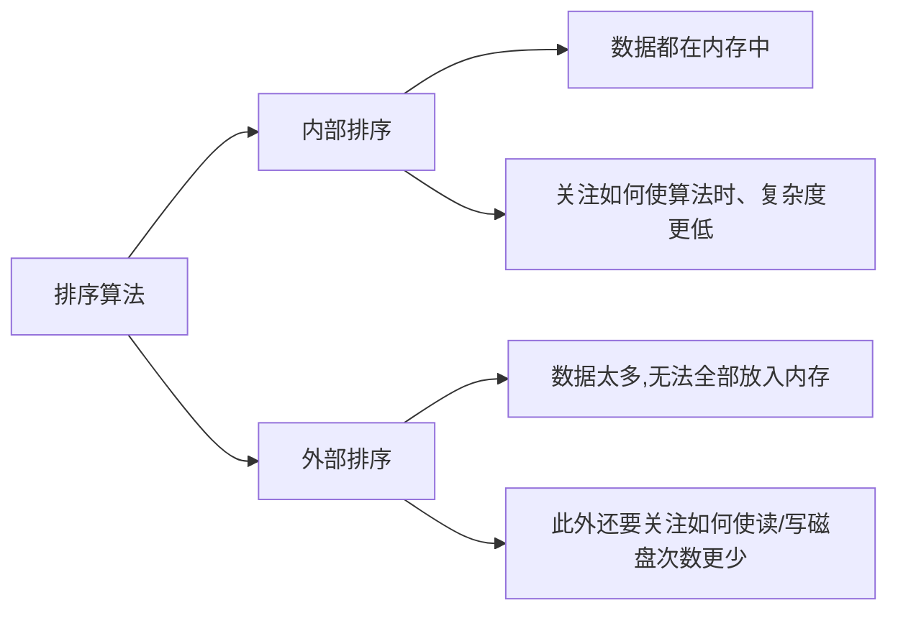

# 排序的基本概念

- 排序:(Sort)是指重新排列序列中的元素,使之按照关键字递增或递减有序排列.其数学描述如下:一个含 $n$个元素的序列 $R=\{R_1,R_2,\cdots,R_n\}$,重新排列$R$中的元素得到序列 $R^\prime=$ $\{R_{1}^{\prime},R_{2}^{\prime},\cdots,R_{n}^{\prime}\}$,使得 $R_1^{\prime}\leqslant R_{2}^{\prime}\leqslant\cdots\leqslant R_{n}^{\prime}$或 $R_1^{\prime}\geqslant R_{2}^{\prime}\geqslant\cdots\geqslant R_{n}^{\prime}$
- **稳定性**:若待排序表中有两个元素$R_i$和$R_j$,其对应的关键字相同即$key_i$=$key_j$, 且在排序前$R_i$在$R_j$的前面,若使用某一排序算法排序后,$R_i$仍然在$R_j$的前面,则称这个排序算法是稳定的,否则称排序算法是不稳定的
- 排序算法主要分为内部排序和外部排序



# 内部排序

## 插入排序

### <font color="red">直接插入排序</font>

- 算法原理:每次将一个待排序的记录按其关键字大小插入前面已排好序的子序列,直到全部记录插入完成
- 算法解释:
- 算法流程:
    <div align=center> </div>
    以上图为例:

  - 初始`L[O...i-1]`是一个排好序的子序列
  - 对于元素`L[i]`插入到前面己经排好序的子序列当中
    - 查找出 `L[i]`在有序序列 `L[0...i-1]`中的插入位置 `k`
    - 将 `L[k...i-1]`中所有元素后移一个位置
    - 将`L[i]`复制到`L[k]`

- 代码

```c++{.line-numbers}
void insertion_sort(int arr[], int len) {
  for (int i = 1; i < len; ++i) {
    int key = arr[i];
    int j = i - 1;
    while (j >= 0 && arr[j] > key) {
      arr[j + 1] = arr[j];//移动元素
      j--;
    }
    arr[j + 1] = key;
  }
}
```

- 复杂度分析:$$\text{空间复杂度:}\mathcal{O}(1)\\\text{时间复杂度:}\mathcal{O}(\mathrm{n}^2)$$
- 特点:
  - 输入敏感(指排序算法的性能表现强烈依赖于输入数据的初始状态,如果是一个本来就是顺序的,就不需要交换,如果是逆序的,就需要大量交换)
  - 稳定排序
  - 直接插入排序适用于顺序存储和链式存储的线性表,采用链式存储时无须移动元素

### 折半插入排序

- 算法流程:
  - 将数组中的数据分成有序和无序的两个部分.初始情况下,第 1 个元素($arr[0]$)有序,后$n-1$个元素无序
  - 循环$n-1$次,将后$n-1$个关键字使用折半查找的方式确定插入位置,并将该位置及其后面的元素统一向后移动 1 位
- 代码:

```c++{.line-numbers}
void insertion_sort(int arr[], int len) {
  if (len < 2) return;
  for (int i = 1; i != len; ++i) {
    int key = arr[i];
    auto index = upper_bound(arr, arr + i, key) - arr;// 此处为优化部分,直接插入排序是从尾开始比大小,折半插入排序是从中间开始比大小
    // 使用 memmove 移动元素,比使用 for 循环速度更快,时间复杂度仍为 O(n)
    memmove(arr + index + 1, arr + index, (i - index) * sizeof(int));
    arr[index] = key;
  }
}
```

- 复杂度分析:折半插入排序与直接插入排序的基本思想是一致的,折半插入排序仅对插入排序时间复杂度中的常数进行了优化,所以优化后的时间复杂度仍然不变
- 特点:
  - 折半插入排序仅适用于顺序存储的线性表
  - 稳定排序算法

### <font color="red">希尔排序</font>

- 算法原理:该排序为插入排序的改进
- 算法解释:先将待排序表分割成若干形如$L[i,i+d,i+2d,...,i+kd]$"特殊"子表,分别进行直接插入排序,当整个表中元"基本有序",再对全体记录进行一次直接插入排序
- 算法流程:
  - 先取小于$n$的步长$d_1$,把表的元素分成$d_1$组,所有距离为$d_1$的元素放在一组
  - 同一组的元素,在各组中进行直接插入排序.
  - 然后取第二个步长$\mathrm{d}_2<\mathrm{d}_1$,重复过程
  - 直到所取$d=1$, 即所有元素在一组中,再直接进行插入排序
- 代码:

```c++{.line-numbers}
void shell_sort(T array[], int length) {
  int h = 1;
  while (h < length / 3) {
    h = 3 * h + 1;
  }
  while (h >= 1) {
    for (int i = h; i < length; i++) {
      for (int j = i; j >= h && array[j] < array[j - h]; j -= h) {
        std::swap(array[j], array[j - h]);
      }
    }
    h = h / 3;
  }
}
```

- 复杂度分析:$$\text{空间复杂度:}\mathcal{O}(1)\\\text{最坏时间复杂度:}\mathcal{O}(\mathrm{n}^2)\\\text{当$n$在某个特定范围时,时间复杂度:}\mathcal{O}(\mathrm{n}^{1.3})$$
- 特点:
  - 不稳定的排序
  - 仅适用于顺序存储的线性表

## 交换排序

### 冒泡排序

- 算法原理:从后往前(或从前往后)两两比较相邻元素的值,若为逆序(即$A[i-1]>A[i]$),则交换它们,直到序列比较完.我们称它为第一趟冒泡,结果是将最小的元素交换到待排序列的第一个位置(或将最大的元素交换到待排序列的最后一个位置),关键字最小的元素如气泡一般逐渐往"漂浮""水面"(或关键字最大的元素如石头一般下沉至水底).

- 算法流程:

  - 将第 1 个关键字($arr[0]$)与第 2 个关键字进行比较,若为逆序,则交换位置,然后继续比较第 2 个和第 3 个关键字,即每次都在相邻元素之间比较.以此类推,直到比较完第$n-1$个关键字和第$n$个关键字,完成一趟排序.
  - 第 2 趟排冒泡排序只需要对前$n-1$个关键字进行同样的操作,使关键字第二大的记录被放到第$n-1$个记录的位置上
  - 重复上述操作,每一趟排序都能使待排记录中的最大关键字被放到最终位置,直到某一趟冒泡排序过程中没有出现过交换操作,则说明序列已经有序,冒泡排序结束(所以冒泡排序可能会提前终止)
  - 下图为冒泡排序过程,第一趟冒泡时:$27<49$,不交换;$13<27$,不交换;$76>13$,交换;$97>13$,交换;$65>13$,交换;$38>13$,交换;$49>13$,交换

  <div align=center> </div>

- 代码:

```c++{.line-numbers}
// 假设数组的大小是 n + 1,冒泡排序从数组下标 1 开始
void bubble_sort(int *a, int n) {
  bool flag = true;
  while (flag) {
    flag = false;
    for (int i = 1; i < n; ++i) {
      if (a[i] > a[i + 1]) {
        flag = true;
        int t = a[i];
        a[i] = a[i + 1];
        a[i + 1] = t;
      }
    }
  }
}
```

- 复杂度分析:在序列完全有序时,冒泡排序只需遍历一遍数组,不用执行任何交换操作,时间复杂度为 $O(n)$.在最坏情况下,冒泡排序要执行 $\dfrac{(n-1)n}2$次交换操作,时间复杂度为 $O(n^2)$.冒泡排序的平均时间复杂度为 $O(n^2)$
- 特点:
  - 稳定排序
  - 冒泡排序适用于顺序存储和链式存储的线性表

### <font color="red">快速排序</font>

- 算法原理:主要通过分治的方式来解决问题
- 算法流程:
  - 假设现在要并序的区间为 $[l,r]$(我们要把目前 $a$ 数组中第 $l$ 个位置到第 $r$ 位置的数排序)
  - 如果区间长度小于等于 $1$ 则直接退出,否则在区间中选择一个数字 $x$ 作为比较元素;
  - 将大于 $×$ 的数字放到右边,小于 $×$ 的数字放到左边,等于 $x$ 的数字想放哪边放哪边,将 $×$ 放在两组数字中间
  - 此时 $×$ 的位置已经确定了,对其左右两边的区间分别进行递归即可
- 为了不使用额外的存储空间,通常使用以下做法
  - 我们会使用两个指针$i$和$j$初始化时$i=1,j=r$
  - $j$ 向左找到第一个<font color="red">小于等于</font> $k$ 的数字,把它放到位置$i$里,然后$i$向右找到第一个大于等于$x$的数字,把它放到位置$j$里;一直重复这个过程,直到两个指针指向同,一个位置$p$,最后把位置$p$的值设置成$×$

1. 确定分界点(随机点$x$,左边界点,有边界点)
2. 调整区间,使得左区间的所有数都小于等于$x$,右区间所有的所有数都大于等于$x$
3. 递归处理左右两段

- 代码:

```c++{.line-numbers}
inline void quicksort(int q[], int l, int r)
{
    if (l >= r) return;
    int i = l - 1, j = r + 1, x = q[l + r >> 1];
    while (i < j)
    {
        do i ++ ; while (q[i] < x);
        do j -- ; while (q[j] > x);
        if (i < j) swap(q[i], q[j]);
    }
    quick_sort(q, l, j), quick_sort(q, j + 1, r);
}
```

- 复杂度分析:快速排序的最优时间复杂度和平均时间复杂度为 $O(n\log n)$,最坏时间复杂度为 $O(n^2)$,但是几乎不可能达到最坏
- 特点:
  - 仅适用于顺序存储的线性表
  - 不稳定的排序
  - 性能最优

## 选择排序

### 简单选择排序

- 算法原理:选择排序(英语:Selection sort)是一种简单直观的排序算法.它的工作原理是每次找出第 $i$ 小的元素(也就是 $A_{i..n}$ 中最小的元素),然后将这个元素与数组第 $i$ 个位置上的元素交换.
- 算法流程:

  - 从待排序序列中,找到关键字最小的元素;
  - 将该元素与待排序序列中的第一个元素交换位置(初始时,有序序列中没有元素);
  - 对于余下的 $n-1$ 个元素,重复上述两个步骤.

- 代码:

```c++{.line-numbers}
void selection_sort(int* a, int n) {
  for (int i = 1; i < n; ++i) {
    int ith = i;
    for (int j = i + 1; j <= n; ++j) {
      if (a[j] < a[ith]) {
        ith = j;
      }
    }
    swap(a[i], a[ith]);
  }
}
```

- 复杂度分析:选择排序的最优时间复杂度、平均时间复杂度和最坏时间复杂度均为 $O(n^2)$.空间复杂度为$O(1)$
- 特点:
  - 适用于顺序存储结构和链式结构.
  - 序列的初始状态不影响比较次数,会影响移动次数.但总体上,初始序列的有序程度对时间效率几乎没有影响.
  - 排序过程中形成有序子序列,并且每次至少都将一个数据元素放到了最终位置.
  - 由于 `swap`(交换两个元素)操作的存在,选择排序是一种不稳定的排序算法

### <font color="red">堆排序</font>

#### [堆](树.md#堆)

此处参考树的应用部分[堆](树.md#堆)

#### 堆排序算法

- 算法原理:**堆排序的本质是建立在堆上的选择排序**
- 算法流程:
  - 首先建立大顶堆,然后将堆顶的元素取出,作为最大值,与数组尾部的元素交换,并维持残余堆的性质;
  - 之后将堆顶的元素取出,作为次大值,与数组倒数第二位元素交换,并维持残余堆的性质;
  - 以此类推,在第 $n-1$ 次操作后,整个数组就完成了排序.
- 代码:

```c++{.line-numbers}
void sift_down(int arr[], int start, int end) {
// 计算父结点和子结点的下标
int parent = start;
int child = parent * 2 + 1;
while (child <= end) {  // 子结点下标在范围内才做比较
  // 先比较两个子结点大小,选择最大的
  if (child + 1 <= end && arr[child] < arr[child + 1]) child++;
  // 如果父结点比子结点大,代表调整完毕,直接跳出函数
  if (arr[parent] >= arr[child])
    return;
  else {  // 否则交换父子内容,子结点再和孙结点比较
    swap(arr[parent], arr[child]);
    parent = child;
    child = parent * 2 + 1;
  }
}
}
void heap_sort(int arr[], int len) {
// 从最后一个节点的父节点开始 sift down 以完成堆化 (heapify)
for (int i = (len - 1 - 1) / 2; i >= 0; i--) sift_down(arr, i, len - 1);
// 先将第一个元素和已经排好的元素前一位做交换,再重新调整(刚调整的元素之前的元素),直到排序完毕
for (int i = len - 1; i > 0; i--) {
  swap(arr[0], arr[i]);
  sift_down(arr, 0, i - 1);
}
}
```

- 复杂度分析:堆排序的最优时间复杂度、平均时间复杂度、最坏时间复杂度均为 $O(n\log n)$.空间复杂为 $O(1)$
- 特点:
  - 不稳定的排序
  - 适用于顺序存储结构和关键字数量大的情况.在构建初始堆时使用的比较操作较多,记录少时排序效率低.
  - 最好情况、最坏情况以及平均情况下的时间复杂度相同.
  - 每次都能选出一个数据元素放在最终位置.

## 归并排序

- 算法流程:

  - 当数组长度为 $1$ 时,该数组就已经是有序的,不用再分解.
  - 当数组长度大于 $1$ 时,该数组很可能不是有序的.此时将该数组分为两段,再分别检查两个数组是否有序(用第 1 条).如果有序,则将它们合并为一个有序数组;否则对不有序的数组重复第 2 条,再合并.
    > 用数学归纳法可以证明该流程可以将一个数组转变为有序数组.
    > 为保证排序的复杂度,通常将数组分为尽量等长的两段($mid = \left\lfloor \dfrac{l + r}{2} \right\rfloor$).

- 代码:

```c++{.line-numbers}
void merge_sort(int q[], int l, int r)
{
    if (l >= r) return;
    int mid = l + r >> 1;
    //递归处理左右区间,直到两区间内元素仅剩下一个,然后就开始合并
    merge_sort(q, l, mid), merge_sort(q, mid + 1, r);
    //合并左右区间
    int k = 0, i = l, j = mid + 1;
    while (i <= mid && j <= r)//只要两指针都未直到左右区间的端点处,则循环一直进行
        if (q[i] <= q[j]) tmp[k ++ ] = q[i ++ ];
        else tmp[k ++ ] = q[j ++ ];
        //每次循环将最小值加入到tmp数组中
    //如果某区间中元素仍有剩余,那么就将其全部加入tmp数组
    while (i <= mid) tmp[k ++ ] = q[i ++ ];
    while (j <= r) tmp[k ++ ] = q[j ++ ];
    for (i = l, j = 0; i <= r; i ++, j ++ ) q[i] = tmp[j];
}
```

- 复杂度分析:归并排序基于分治思想将数组分段排序后合并,时间复杂度在最优、最坏与平均情况下均为 $\Theta (n \log n)$,空间复杂度为 $\Theta (n)$.归并排序可以只使用 $\Theta (1)$ 的辅助空间,但为便捷通常使用与原数组等长的辅助数组.

- 特点:
  - 空间复杂度较高
  - 可能在最后一趟排序前所有元素都不在最终位置
  - 合并多个有序的序列,使用归并排序最好

## 基数排序

- 算法原理:基数排序就是对待排序序列依次按照关键字的每一位进行排序.若序列中每个关键字 $key_i$ 可以分成 $d$ 个更简单关键字 $key_i^{d-1},key_i^{d-2},\cdots,key_i^0$,则可以采用最高位优先 $(MSD)$ 或最低位优先 $(LSD)$ 对序列进行基数排序
- 算法流程:

  - 将所有待比较数值(正整数)统一为同样的数位长度,数位较短的数在高位补零;
  - 从最低位开始,遍历待排序列,将对应关键字放入队列中,此过程称为一"分配"操作;
  - 将各个队列中的关键字按顺序收集,成为一个新的待排序的序列,此过程称为一"收集"操作;
  - 依次对高一位数继续进行步骤(2)和步骤(3) "分配""收集"操作,总共进行 i 次, 直到所有的位都完成排序.
    

- 代码:

```c++{.line-numbers}
int n, m = 10, a[N + 1], sa[N + 1], v[N + 1], r[N + 1], c[10];
// n代表有多少数字,m代表这些数字有多少位,a记录一开始有多少数,sa记录排完序,第i个位置上一开始是第几个数,vi记录某一次基数排序的时候第一关键字是什么,ri记录第i个数排完序的位置,c用来统计每一个数字出现多少次做前缀和然后求rank
inline void countingsort()
{
    memset(c, 0, sizeof(c));
    for (int i = 1; i <= n; i++)
        ++c[v[i]];
    for (int i = 1; i <= 9; i++)
        c[i] += c[i - 1];
    for (int i = n; i; --i)
        r[sa[i]] = c[v[sa[i]]]--;
    for (int i = 1; i <= n; i++)
        sa[r[i]] = i;
}
inline void radixsort()
{
    for (int i = 1; i <= n; i++)
        sa[i] = i;
    int x = 1;
    for (int i = 1; i <= m; i++, x *= 10)
    {
        for (int j = 1; j <= n; j++)
            v[j] = a[j] / x % 10;
        countingsort();
    }
    for (int i = 1; i <= n; i++)
        printf("%d ", a[sa[i]]);
    printf("\n");
}
```

- 复杂度分析:若每个关键字可以分为 $d$ 级关键字,则需进行 $d$ 次“分配”和“收集”操作.一次“分配”操作需要遍历所有关键字,时间复杂度为 $O(n);$ 一次“收集”操作需要遍历遍历 $r$ 个队列,时间复杂度为 O$(r).d$ 次分配和收集操作总共需要时间复杂度为 $O(d(n+r))$.基数排序需要借助$r$个队列作为分配操作的辅助空间,其中$r$为关键字的基数(十进制整数的基数为 10).因此基数排序的空间复杂度为 $O(r)$.
- 特点:
  - 稳定排序算法
  - 既适用于顺序结构,也适用于链式结构.
  - 使用前必须给定每一级关键字的优先级.
  - 时间复杂度与初始状态无关.
  - 适用于 n 较大,但 d 和 r 较小的序列.

# 外部排序

## 多路归并排序

## 败者树

## 置换-选择排序

## 最佳归并树

# <font color="red">排序算法的比较</font>

## 性能分析

## 排序算法对比
